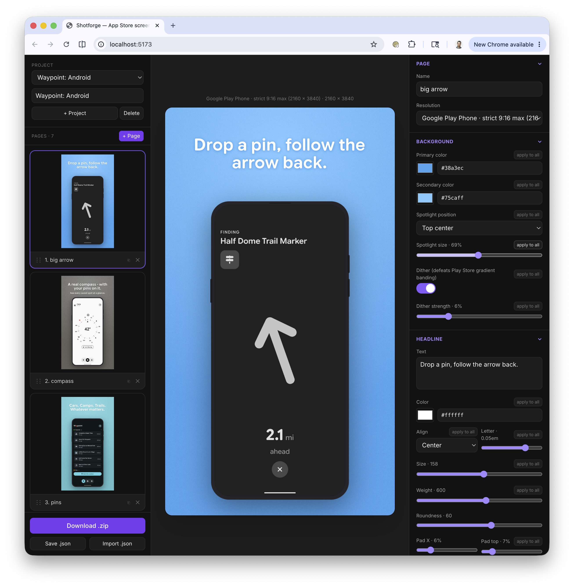

# Shotforge

A web app for generating polished App Store / Google Play store screenshots — with the exact aesthetic I want (Material You vibes, Google Sans Flex, custom gradients) instead of paying for a tool that doesn't quite fit.



## What it does

Design store-listing screenshots in the browser: pick a device resolution preset, set a spotlight gradient background, add a headline and subhead, drop a screenshot into a charcoal phone frame, and reorder pages by drag-and-drop. Export every page as full-resolution PNGs in a single `.zip`.

The live preview uses the same renderer as the export, so **what you see is what you get**.

## Tech stack

- Vite + React + TypeScript
- Tailwind v3
- Zustand (`persist` middleware, localStorage) for project state
- @dnd-kit/sortable for drag-to-reorder pages
- html-to-image for rasterizing the DOM at full resolution
- JSZip + file-saver for the `.zip` download

## Getting started

```bash
npm install
npm run dev      # start the dev server
npm run build    # type-check + production build
npm run preview  # preview the production build
```

## How it works

A single `PageRenderer` component renders a page at any pixel size — scaled down for the live preview, and at the preset's true dimensions (offscreen) for export. Change the renderer and both update together.

Project state is a `Project` with a shared `theme` and a `pages[]` array; each `Page` holds its own resolution, colors, spotlight, text, and device config. "Apply theme to all pages" is a one-shot push so per-page tweaks survive later theme edits.

## Project layout

| Path | Purpose |
| --- | --- |
| `src/App.tsx` | Three-panel layout |
| `src/components/Sidebar.tsx` | Page list, project switcher, export buttons |
| `src/components/CanvasArea.tsx` | Center preview, auto-scales to fit |
| `src/components/ControlPanel.tsx` | Right panel — all controls |
| `src/components/PageRenderer.tsx` | The render component (preview + export) |
| `src/components/DeviceFrame.tsx` | Generic charcoal phone frame |
| `src/lib/store.ts` | Zustand store with persistence |
| `src/lib/presets.ts` | Resolution presets + spotlight position lookups |
| `src/lib/export.ts` | Full-resolution PNG render → ZIP / JSON I/O |
| `src/types.ts` | `Page` / `Project` / `TextLayer` types |
